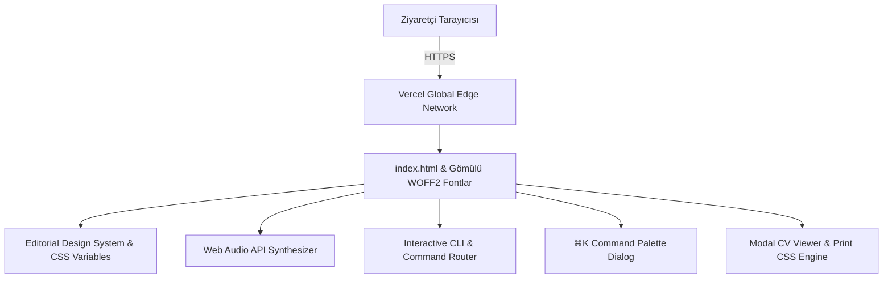

<div align="center">

# ✦ Mehmet Emin Akkaya — Kişisel Web Sitesi & Portfolyo

[](https://mehmeteminakkaya.com)
[](https://mehmeteminakkaya-com.vercel.app)
[](https://mehmeteminakkaya.com)
[](LICENSE)

<p align="center">
  <strong>"Kod, Merak ve Momentum."</strong><br>
  Yapay zekâ, mobil deneyimler ve algoritmik düşünceyi somut ürünlere dönüştüren bilgisayar mühendisliği portfolyosu.
</p>

[Canlı Portfolyoyu Ziyaret Et ↗](https://mehmeteminakkaya.com) • [LinkedIn](https://www.linkedin.com/in/mehmeteminakkaya/) • [E-Posta](mailto:mehmeteminakkaya12@gmail.com)

---

</div>

## 🌟 Öne Çıkan Özellikler

* **🖋️ Editoryal & Lüks Minimalist Tasarım:** Tipografik hiyerarşi, özel HSL renk paleti ve gömülü (zero-CDN) WOFF2 font mimarisi.
* **💻 Canlı Etkileşimli CLI Terminal (`#lab`):** Klavyeden gerçek komutları çalıştıran dahili terminal (`help`, `whoami`, `projects`, `migo`, `kobiflow`, `studybuddy`, `benimhakkimda`, `todogemini`, `skills`, `cv`, `contact`, `theme`, `clear`, `matrix`, `sudo`).
* **🔊 Web Audio API Ses Sentezleyici Motoru:** Sıfır harici ses dosyasıyla osilatör tabanlı gerçek zamanlı mekanik tuş ve klik ses geri bildirimi (Açılabilir / Kapatılabilir).
* **⌨️ ⌘K / Ctrl+K Komut Paleti:** Sayfa içi hızlı erişim, tema geçişi ve sürpriz (chaos) modları.
* **💡 Dinamik Fikir Makinesi:** Odak alanlarına özel 16 özgün fikir ve tek tıkla doğrudan e-posta taslağı oluşturan entegrasyon.
* **🌓 Day & Night Akıllı Tema:** Sistem tercihine duyarlı ve `localStorage` ile kalıcı Gece/Gündüz renk paleti.
* **📱 Web Share API & Dijital CV:** Portfolyoyu doğrudan mobil paylaşım menüsünden paylaşma ve yazdırılabilir CV modalı.

---

## 🏗️ Mimari & Teknoloji Yığını



| Katman | Teknoloji | Açıklama |
| :--- | :--- | :--- |
| **İskelet & Yapı** | HTML5 | Semantik HTML, SEO meta etiketleri, OpenGraph |
| **Stil & Tasarım** | Vanilla CSS | HSL renk tokenları, Grid & Flexbox, Fluid Typography |
| **Etkileşim & Mantık** | Vanilla JavaScript (ES6+) | CLI parser, ⌘K paleti, Intersection Observer |
| **Ses Motoru** | Web Audio API | Donanımsal osilatör sentezi (Sıfır MP3/WAV bağımlılığı) |
| **Yayın / Hosting** | Vercel Edge Network | Sıfır gecikmeli global CDN, otomatik SSL |

---

## 🚀 Yerel Geliştirme & Kurulum

Bu proje hiçbir harici kütüphane veya paket yüklemesi (`node_modules`) gerektirmez.

```bash
# 1. Depoyu klonlayın
git clone https://github.com/mehmeteminakkaya/mehmeteminakkaya.com.git

# 2. Proje dizinine girin
cd mehmeteminakkaya.com

# 3. Herhangi bir yerel statik sunucuyla veya doğrudan tarayıcıda açın
npx serve .
# veya
python -m http.server 3000
```

Tarayıcınızda `http://localhost:3000` adresini açarak inceleyebilirsiniz.

---

## 👨‍💻 Geliştirici & İletişim

**Mehmet Emin Akkaya**  
*İstinye Üniversitesi Bilgisayar Mühendisliği | Bilişim Kulübü B. Yardımcısı*

* 🌐 **Web Sitesi:** [mehmeteminakkaya.com](https://mehmeteminakkaya.com)
* 💼 **LinkedIn:** [linkedin.com/in/mehmeteminakkaya](https://www.linkedin.com/in/mehmeteminakkaya/)
* 🐙 **GitHub:** [@mehmeteminakkaya](https://github.com/mehmeteminakkaya)
* 📬 **E-Posta:** [mehmeteminakkaya12@gmail.com](mailto:mehmeteminakkaya12@gmail.com)

---

<div align="center">
  <sub>Telif Hakkı © 2026 Mehmet Emin Akkaya. Tüm hakları saklıdır.</sub>
</div>
